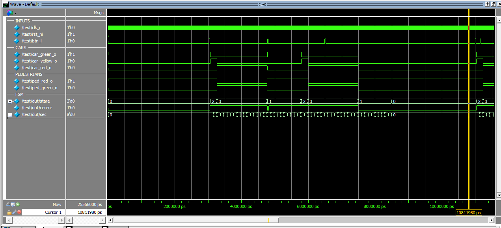

# FPGA Traffic Light Controller with Pedestrian Button

A Verilog FPGA project implementing a traffic light controller for cars and pedestrians using a finite state machine (FSM).

The controller allows pedestrians to request a crossing using a push button while ensuring a minimum green time for cars between pedestrian crossings.

## Overview

The design controls:

- car red, yellow and green lights
- pedestrian red and green lights
- pedestrian push-button requests
- configurable traffic light timings

The FSM contains five states:

```text
INITIAL
GREEN
YELLOW
RED
DONE
```

### Normal operation

`INITIAL` is the normal waiting state.

Cars remain green and pedestrians remain red until a pedestrian request is detected.

```text
INITIAL
   |
   | pedestrian button
   v
YELLOW
   |
   v
RED
   |
   v
DONE
   |
   v
GREEN
   |
   | minimum green time
   v
INITIAL
```

After a pedestrian crossing finishes, cars must remain green for at least 10 seconds before another crossing can start.

If the pedestrian button is pressed during this mandatory green period, the request is stored and handled after the minimum green time has passed.

## Timing

Default timing parameters:

| State | Duration |
|---|---:|
| Cars green after crossing | 10 s minimum |
| Cars yellow | 2 s |
| Cars red / Pedestrians green | 15 s |

The values can be changed through module parameters:

```verilog
parameter CLK_HZ   = 12_000_000,
parameter T_ROSU   = 15,
parameter T_VERDE  = 10,
parameter T_GALBEN = 2
```

## Button Handling

The pedestrian button is synchronized to the FPGA clock using two flip-flops.

A rising edge is detected using the previous synchronized value:

```verilog
wire front = t_sync2 & ~t_prev;
```

The request is stored until the controller can safely start a pedestrian crossing.

Button presses are ignored while pedestrians already have green.

## Verification

A SystemVerilog testbench is included to check the main operating conditions.

The testbench verifies:

- correct state after reset
- cars remain green when no button is pressed
- complete pedestrian crossing sequence
- yellow light duration
- pedestrian green duration
- minimum green time for cars after a crossing
- button press while pedestrians already have green
- button press during yellow
- button held high
- reset during a crossing
- safety conditions for car and pedestrian lights

The testbench also continuously checks that:

```text
exactly one car light is active
exactly one pedestrian light is active
pedestrians can only have green when cars have red
```

## Waveform

The waveform below shows the pedestrian button, car lights, pedestrian lights and internal FSM state during simulation.



FSM encoding:

```text
0 = INITIAL
1 = GREEN
2 = YELLOW
3 = RED
4 = DONE
```

## Project Structure

```text
lattice-fpga-traffic-light/
├── rtl/
│   └── counter.v
│
├── tb/
│   └── test.v
│
├── sim/
│   ├── sim.do
│   └── wave.do
│
├── constraints/
│   └── traffic_light.lpf.example
│
├── docs/
│   └── waveform.png
│
├── .gitattributes
├── .gitignore
├── LICENSE
└── README.md
```

## Files

| File | Description |
|---|---|
| `rtl/counter.v` | Traffic light FSM and timing logic |
| `tb/test.v` | Self-checking SystemVerilog testbench |
| `sim/sim.do` | Questa/ModelSim simulation script |
| `sim/wave.do` | Waveform configuration |
| `constraints/traffic_light.lpf.example` | Example Lattice LPF structure |
| `docs/waveform.png` | Simulation waveform |

## Simulation

The design was simulated using **Questa Altera Starter FPGA Edition**.

From the `sim` directory:

```tcl
do sim.do
```

The testbench is compiled as SystemVerilog:

```tcl
vlog -sv ../tb/test.v
```

A reduced clock frequency is used in simulation so that one simulated traffic-light second does not require millions of FPGA clock cycles.

## FPGA Target

The project targets a **Lattice MachXO3LF FPGA** and was developed around the Lattice Diamond / ModelSim workflow.

The current repository includes an example LPF file structure. Physical FPGA pin assignments depend on the exact development board and should be filled in using the board documentation.

## Technologies

- Verilog HDL
- SystemVerilog testbench
- Finite State Machines
- Digital logic
- Questa / ModelSim
- Lattice Diamond
- Git

## Status

**RTL and simulation complete**

```text
FSM operation          VERIFIED
Pedestrian requests    VERIFIED
Traffic light timing   VERIFIED
Safety conditions      VERIFIED
Reset behavior         VERIFIED
Waveform inspection    VERIFIED
```
